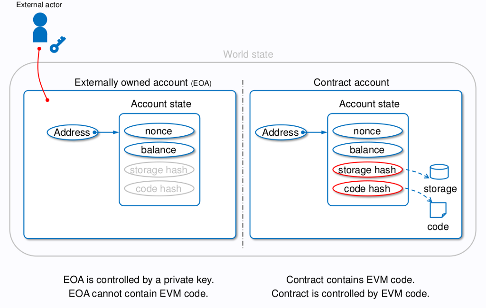

## Solidity and Smart Contract

#### Account



- Externally Owned Account ( EOA )
    - Address: 160-bit length ( 20 bytes ), locate to this account
    - Account State
        - nonce: tx's sequence
        - balance

- Contract Account
    - Address: 160-bit length ( 20 bytes ), locate to this contract, contract address will base on EOA and nonce
    - Account State
        - nonce
        - balance
        - code hash: bytecode's location
        - storage hash: state variables

#### Transaction

- Transfer Ether
    - From: sender
    - To: recipient
    - Value: Ether amount
    - Data: note

- Create contract
    - From: sender
    - To: empty
    - Value: empty or send Ether to your contract
    - Data: bytecode

- Call contract function
    - ***Smart contract will never execute by itself***
    - Function runing on Ethereum Virtual Machine ( EVM )
    - Every opcode and storage has the same price ( gas )
    - Doesn't have random opcode ( 0.1 + 0.9 = 0.999... )

#### EVM


- EVM code: locate by contract account's code hash
- program counter: read next executed opcode
- gas available: Tx fail when out of available gas
    - storage
        - stack
            - Free of gas
            - Stored temporary
            - Contains words of 256-bit
            - Maximum size of 1024 elements

        - memory
            - Spent a little gas ( for expansion )
            - Stored temporary
            - Contains words of 256-bit
            - Expanded by a word ( 256-bit ), when accessing untouched memory word
            - Storage is linear ( array )

        - account storage
            - Spent lots of gas
            - Data stored permanently
            - Storage is a key-value store that maps 256-bit words to 256-bit words.

> When 'CompilerError: Stack too deep, try removing local variables' happened, try to use struct or memory


#### Code example

- Source code

    ```sol
    // SPDX-License-Identifier: GPL-3.0

    pragma solidity >=0.7.0 <0.9.0;

    /**
    * @title Storage
    * @dev Store & retrieve value in a variable
    */
    contract Storage {

        uint256 private number;

        /**
        * @dev Store value in variable
        * @param num value to store
        */
        function store(uint256 num) public {
            number = num;
        }

        /**
        * @dev Return value 
        * @return value of 'number'
        */
        function retrieve() public view returns (uint256){
            return number;
        }
    }
    ```

- Bytecode: compiled source code

    ```json
    {
        "generatedSources": [],
        "linkReferences": {},
        "object": "608060405234801561001057600080fd5b5061012f806100206000396000f3fe6080604052348015600f57600080fd5b506004361060325760003560e01c80632e64cec11460375780636057361d146051575b600080fd5b603d6069565b6040516048919060c2565b60405180910390f35b6067600480360381019060639190608f565b6072565b005b60008054905090565b8060008190555050565b60008135905060898160e5565b92915050565b60006020828403121560a057600080fd5b600060ac84828501607c565b91505092915050565b60bc8160db565b82525050565b600060208201905060d5600083018460b5565b92915050565b6000819050919050565b60ec8160db565b811460f657600080fd5b5056fea26469706673582212205e6411c91b9e96d02af16012cab24c6f2110857094a9a707f2692844537e4cd064736f6c63430008020033",
        "opcodes": "PUSH1 0x80 PUSH1 0x40 MSTORE CALLVALUE DUP1 ISZERO PUSH2 0x10 JUMPI PUSH1 0x0 DUP1 REVERT JUMPDEST POP PUSH2 0x12F DUP1 PUSH2 0x20 PUSH1 0x0 CODECOPY PUSH1 0x0 RETURN INVALID PUSH1 0x80 PUSH1 0x40 MSTORE CALLVALUE DUP1 ISZERO PUSH1 0xF JUMPI PUSH1 0x0 DUP1 REVERT JUMPDEST POP PUSH1 0x4 CALLDATASIZE LT PUSH1 0x32 JUMPI PUSH1 0x0 CALLDATALOAD PUSH1 0xE0 SHR DUP1 PUSH4 0x2E64CEC1 EQ PUSH1 0x37 JUMPI DUP1 PUSH4 0x6057361D EQ PUSH1 0x51 JUMPI JUMPDEST PUSH1 0x0 DUP1 REVERT JUMPDEST PUSH1 0x3D PUSH1 0x69 JUMP JUMPDEST PUSH1 0x40 MLOAD PUSH1 0x48 SWAP2 SWAP1 PUSH1 0xC2 JUMP JUMPDEST PUSH1 0x40 MLOAD DUP1 SWAP2 SUB SWAP1 RETURN JUMPDEST PUSH1 0x67 PUSH1 0x4 DUP1 CALLDATASIZE SUB DUP2 ADD SWAP1 PUSH1 0x63 SWAP2 SWAP1 PUSH1 0x8F JUMP JUMPDEST PUSH1 0x72 JUMP JUMPDEST STOP JUMPDEST PUSH1 0x0 DUP1 SLOAD SWAP1 POP SWAP1 JUMP JUMPDEST DUP1 PUSH1 0x0 DUP2 SWAP1 SSTORE POP POP JUMP JUMPDEST PUSH1 0x0 DUP2 CALLDATALOAD SWAP1 POP PUSH1 0x89 DUP2 PUSH1 0xE5 JUMP JUMPDEST SWAP3 SWAP2 POP POP JUMP JUMPDEST PUSH1 0x0 PUSH1 0x20 DUP3 DUP5 SUB SLT ISZERO PUSH1 0xA0 JUMPI PUSH1 0x0 DUP1 REVERT JUMPDEST PUSH1 0x0 PUSH1 0xAC DUP5 DUP3 DUP6 ADD PUSH1 0x7C JUMP JUMPDEST SWAP2 POP POP SWAP3 SWAP2 POP POP JUMP JUMPDEST PUSH1 0xBC DUP2 PUSH1 0xDB JUMP JUMPDEST DUP3 MSTORE POP POP JUMP JUMPDEST PUSH1 0x0 PUSH1 0x20 DUP3 ADD SWAP1 POP PUSH1 0xD5 PUSH1 0x0 DUP4 ADD DUP5 PUSH1 0xB5 JUMP JUMPDEST SWAP3 SWAP2 POP POP JUMP JUMPDEST PUSH1 0x0 DUP2 SWAP1 POP SWAP2 SWAP1 POP JUMP JUMPDEST PUSH1 0xEC DUP2 PUSH1 0xDB JUMP JUMPDEST DUP2 EQ PUSH1 0xF6 JUMPI PUSH1 0x0 DUP1 REVERT JUMPDEST POP JUMP INVALID LOG2 PUSH5 0x6970667358 0x22 SLT KECCAK256 0x5E PUSH5 0x11C91B9E96 0xD0 0x2A CALL PUSH1 0x12 0xCA 0xB2 0x4C PUSH16 0x2110857094A9A707F2692844537E4CD0 PUSH5 0x736F6C6343 STOP ADDMOD MUL STOP CALLER ",
        "sourceMap": "133:364:0:-:0;;;;;;;;;;;;;;;;;;;"
    }
    ```

- ABI (Application Binary Interface): readable interface

    ```json
    [
        {
            "inputs": [],
            "name": "retrieve",
            "outputs": [
                {
                    "internalType": "uint256",
                    "name": "",
                    "type": "uint256"
                }
            ],
            "stateMutability": "view",
            "type": "function"
        },
        {
            "inputs": [
                {
                    "internalType": "uint256",
                    "name": "num",
                    "type": "uint256"
                }
            ],
            "name": "store",
            "outputs": [],
            "stateMutability": "nonpayable",
            "type": "function"
        }
    ]
    ```

#### Dev tools

- [remix.ethereum.org](https://remix.ethereum.org/)
    - IDE
    - Plugin
        - SOLIDITY COMPILER
        - DEBUGGER
        - SOLHINT LINTER
        - ETHDOC - DOCUMENTATION GENERATOR
        - ETHDOC VIEWER

- [metamask.io](https://metamask.io/)
    - Wallet
    - Receive Ether
    - Use in testnet or mainnet either

- [etherscan.io](https://etherscan.io/)
    - Check tx status
    - Verify and publish contract source code
    - Call contract function

- Faucet
    - get testnet's Ether

#### Basic structure

1. License
    - Open source license or unlicense
        - [spdx.org](https://spdx.org/licenses/)

            ```sol
            // SPDX-License-Identifier: MIT
            ```

2. Pragma
    - version pragma
        - 0.7.0 ~ 0.8.*

            ```sol
            pragma solidity >=0.7.0 <0.9.0;
            ```

        - 0.7.2 ~ 0.7.*

            ```sol
            pragma solidity ^0.7.2
            ```

        - 0.8.7

            ```sol
            pragma solidity =0.8.7
            ```

3. Comments
    - Single line
        
        ```sol
        // This is a comment
        ```

    - Multiple lines

        ```sol
        /*
        This
        is 
        a
        comment
        */
        ```

    - ETHDOC related
        - @title
        - @dev
        - @param
        - @return

4. Contract
    - Basic level of smart contract

        ```sol
        contract Storage {
            ...
        }
        ```

    - Extands contract

        ```sol
        contract A {
            uint256 public x;

            function setValue(uint256 _x) public virtual {
                x = _x;
            }
        }

        contract B {
            uint256 public y;

            function setValue(uint256 _y) public virtual {
                y = _y;
            }
        }

        contract C is A, B {
            function setValue(uint256 z) public override(A,B) {
                A.setValue(z);
                B.setValue(z + z);
            }


            function setX(uint256 _x) public {
                x = _x;
            }

            function setY(uint256 _y) public {
                y = _y;
            }
        }
        ```


5. State variables
    - Without the function's variable
    - Stored in account storage

        ```sol
        contract Storage {
            uint256 private number;

            ...
        }
        ```

6. Function
    - Constructor
        - Execute while the smart contract was created

            ```sol
            constructor() {
                // set initial value
                ...
            }
            ```

        - Args in constructor

            ```sol
            constructor(args) {
                ...
            }
            ```

        - Default contructor as below

            ```
            constructor() {}
            ```

    - Function
        - Execute by call function
        - Declare function

            ```sol
            function name(args) visibility mutability returns(return variables) { ... }
            ```

            ```sol
            function helloWorld() public pure returns(string memory) {
                return "Hello World";
            }
            ```

        - Getter function
            - Generate by public state variable
            - Example: uint256 public number

                ```
                function number() public view returns(uint256) {
                    return number;
                }
                ```

        - Args

            ```
            function add(uint256 a , uint256 b) public pure returns (uint256) {
                return a + b;
            }
            ```

        - Return value
            1. return by variable

                ```sol
                function retrieve() public view returns (uint256 result) {
                    result = number;
                }
                ```

            2. return by type

                ```sol
                function retrieve() public view returns (uint256) {
                    return number;
                }
                ```

            3. void

                ```sol
                function test() public {...}
                ```

    - Receive function
        - Receive Ether
        - One contract at most one receive function
        - Trigger by send(), transfer() ...etc
        - Message call without calldata or with Ether value
        - If receive function not exists, it'll find fallback function
        - Receive function must declare as follow

            ```sol
            receive() external payable {
                ...
            }
            ```

    - Fallback function
        - Receive Ether befor 0.6.0 version
        - One contract at most one fallback function
        - Trigger when function not found
        - Receive Ether with payable

            ```sol
            fallback() external payable {
                ...
            }
            ```
        
        - Exception when receive Ether without payable

            ```sol
            fallback() external {
                ...
            }
            ```

    - Payable function
        - Declare modifier of 'payable' that the function has the ability to receive Ether

            ```sol
            function test() external payable {
                ...
            }
            ```

    - Modifier
        - Visibility
            - public
                - Part of ABI
                - Call by internal, another contract or EOA's message call
                - Generate getter when use on state variables

            - private
                - Call by internal
                - It's just can't call, but we still can read it on the blockchain's world state

            - external
                - Part of ABI
                - Call by another contract or EOA's message call
                - Can't use for internal or state variables
                - Large array operations are efficient because they will use original memory space, but not memory copy

            - internal
                - Call by internal or derived contract

        - Mutability ( state mutability )

            ||read state|write state|
            |-|:-:|:-:|
            |pure|X|X|
            |view|O|X|
            |default|O|O|

            - Write state activities ( change state )
                - Modify state variables
                - Publish event 
                - Create another contract
                - Call selfdestruct
                - Send Ether
                - Call function without pure/view
                - Low-level calls
                - Call specific opcodes

            - Read state activities
                - Read state variables
                - Read current contract or external contract's balance
                - Use state info like block, tx, msg ... etc
                    - Exclude msg.sig, msg.data

                - Call function without pure
                - Call specific opcodes

        - Customize modifier
            - _; is required

                ```sol
                modifier onlyAdmin {
                    require(msg.sender == admin, "Permission denied.");
                    _;
                }

                function plus1() public onlyAdmin {
                    number += 1;
                }
                ```
